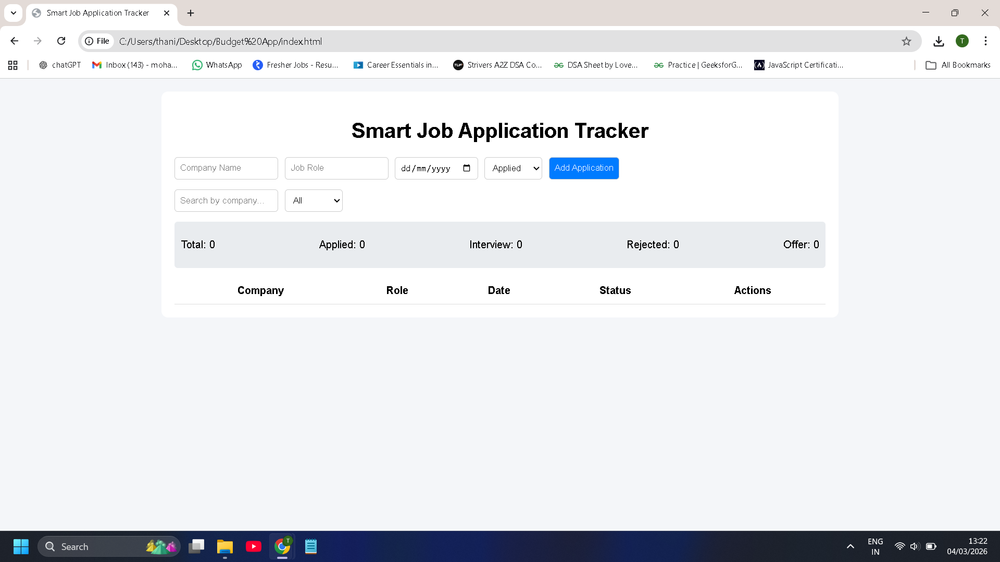
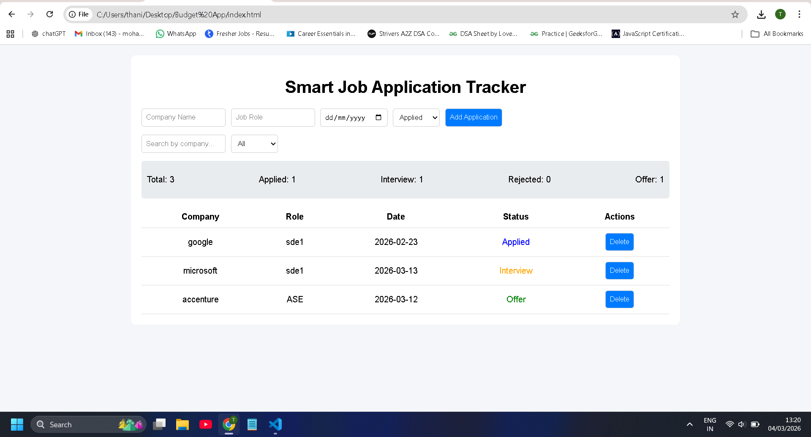

# 🚀 Smart Job Application Tracker

A responsive web application built using HTML, CSS, and JavaScript to efficiently track and manage job applications.

---

## 🌐 Live Demo

👉 **[Click Here to View Live Project](https://yourusername.github.io/smart-job-application-tracker/)**

(Replace `yourusername` with your actual GitHub username.)

---

## ✨ Features

- Add and Delete Job Applications
- Search by Company Name
- Filter by Application Status
- Real-time Dashboard Statistics
- Persistent Data using LocalStorage
- Clean and Responsive UI

---

## 🛠 Tech Stack

- HTML5
- CSS3
- JavaScript (Vanilla JS)

---

## 📸 Screenshots

### 📊 Dashboard View

---

### ➕ Add Application

